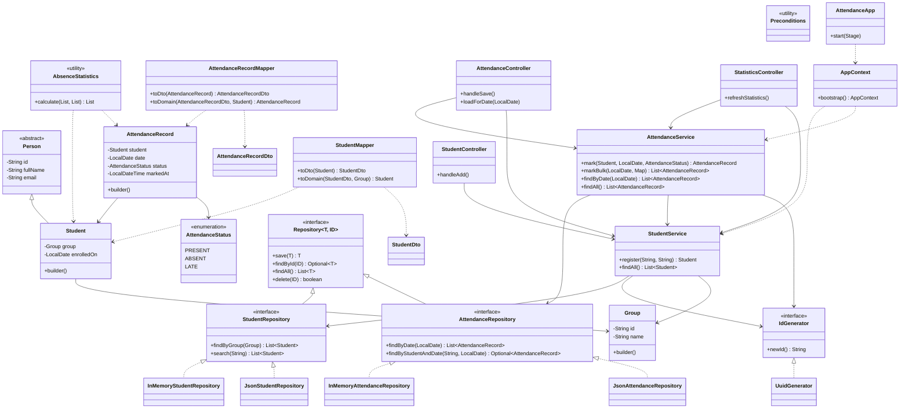

# UML Class Diagram — Student Attendance Tracker

Class diagram of the system as implemented (post-cleanup). It reflects the
classes wired into the running application and excludes the unused
`Course`, `Lecture`, `Lecturer`, `DatabaseManager`, and `AttendanceReportService`
that appeared in earlier design drafts.

**Legend:** solid arrow (`-->`) = association / uses · dashed arrow (`..>`) =
dependency · hollow triangle (`<|--`) = inheritance / interface extension ·
dashed triangle (`<|..`) = interface implementation.

